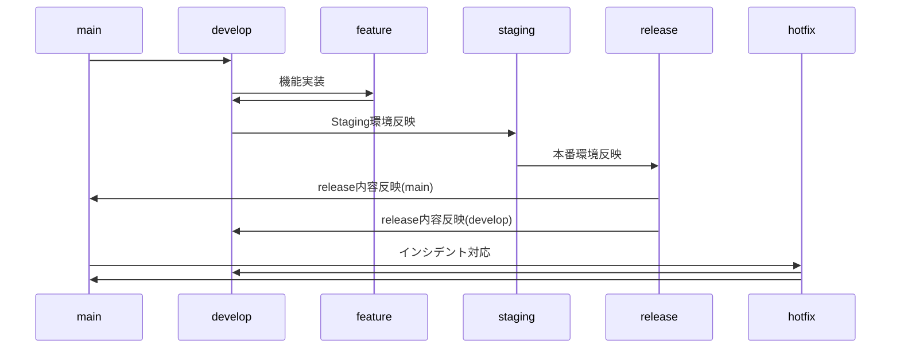

# コーディング規約

対象: **CardGame-Client** (`KTC.*`) と **com.kitsune-creative.unityframework** (`UnityFramework.*`)。
Go サーバー (CardGame-Server) は末尾の Go 章のみ。迷ったらこの文書を正とし、変更するときはこの文書を先に更新すること。

## C# 命名

| 対象 | 規則 | 例 |
|---|---|---|
| クラス / 構造体 / enum (メンバー含む) | PascalCase | `HandEngine`, `Street.Preflop` |
| インターフェース | `I` + PascalCase | `IGameSession`, `IBotPolicy` |
| メソッド | PascalCase。非同期は `Async` 接尾辞 | `PrepareAsync`, `SendAction` |
| プロパティ | PascalCase | `MySeatIndex`, `IsComplete` |
| **Const (const / static readonly)** | **SCREAMING_SNAKE_CASE** | `FONT_ADDRESS`, `SEAT_OPTIONS` |
| static フィールド (可変) | UpperCamel (PascalCase) | `CachedInstance`, `CurrentBgm` |
| private インスタンスフィールド | `_camelCase` | `_session`, `_isTransitioning` |
| **`[SerializeField]` フィールド** | **`_camelCase` (アンスコ有り)** | `_potText`, `_seatTemplate` |
| ローカル変数 / 引数 | camelCase | `raiseTo`, `viewerSeat` |

### bool の命名
- プロパティ / static: `Is` / `Has` + PascalCase — `IsComplete`, `HasSave`
- インスタンスフィールド (変数) はアンスコ付き — `_isPlaying`, `_prepared`
- **`Can` は使わない方向** (可否は `Is〜Allowed` / `〜Enabled` などで表現)。
  ※ 既存プロトコルの `canCheck` / `canCall` / `canRaise` (Messages.cs / API.md / Go) は
  wire 互換のため当面維持。プロトコル改版時に合わせて改名する

### 禁止 (他流儀の混入)
- `m_` / `s_` プレフィックス (Unity 内部ソースの流儀)

### SerializeField の注意
- 既存の `[SerializeField]` を改名するときは **必ず `[FormerlySerializedAs("旧名")]`** を付け、
  シーン/プレハブの配線を守る (シーンベイク方式で参照が大量にあるため厳守)。
  FSA を付けずにコンパイルした状態でシーンを開いて保存すると参照が消える

## 不要なもの

保守性・可読性向上のため、不要なものは消す:
- 使用しなくなった画像などのアセット
- 不要な変数や using
- 無効にするためのコメントアウト (コードは消す。履歴は git にある)

## 定数 / Enum

- **宣言場所は適切に選ぶ**:
  - 1クラス内でのみ使用 → そのクラス内に配置
  - シーン内で使い回す → シーンごとの Const ファイル (`ConstHome.cs` 等) を作成して使用
    - 共通化できないかも検討する
  - 汎用的なもの → `Assets/Scripts/Common/Consts/Consts.cs` に記載
- **マジックナンバーは基本的に禁止**、定数化する
  - `if (hogeList.Count == 0)` や `text.alpha = 1.0f` など自明なものは不要
  - 定数化しない場合で意図が要る値はコメントで詳細を書く
- **表示テキストは必ず定数化し Const〜ファイルに記載**
  - 変更を容易にするため / 将来のグローバル展開 (ローカライズ) を考慮
- enum も同様に、使用範囲に応じた宣言場所を選ぶ

## 文字列

- **文字列の結合に `+` は使用しない**。このプロジェクトでは `ZString.Format` + 定数を使う

```csharp
// Bad 👎
string hoge = "ユーザー名：" + player.Name;

// Good 👍 (本プロジェクトは ZString)
string hoge = ZString.Format(Consts.VIEW_USER_NAME, player.Name);
```

## テスト

- クラス名: `<対象>Tests` (`HandEngineTests`)
- **メソッド名は日本語で仕様を書く**: `無料でチェックできるなら絶対に降りない()`

## 名前空間 / asmdef

- ゲーム: `KTC.<領域>` — `KTC.Poker.Domain` / `KTC.Scene` / `KTC.SaveData` / `KTC.Boot` / `KTC.UI` など
- フレームワーク: `UnityFramework.<領域>`
- asmdef 名 = ルート名前空間と一致させる
- 「アプリの知識 (AppSecret・PlayerData・卓ルール等) を持つものはゲーム側、持たないものはフレームワーク側」

## Unity アセット / シーン

- GameObject: PascalCase (`StartButton`, `SafeArea`, `SeatTemplate`)
- テンプレート複製の子構造は**名前がコントラクト** (例: 席パネルの `Inner/Name/Stack/Bet/State`)。改名はコード側と同時に
- Addressables アドレス: `<グループ>/<名前>` (`SE/Click`, `BGM/Menu`, `Modals/Blinds`)

## Git

### ブランチ構成 (クライアント)



### ブランチ運用

1. 作業ブランチ作成 — `feature/[作業が分かる名称(snake_case)]`
2. コミット/プッシュを行い PR 作成
3. 必要に応じて他エンジニアへレビュー依頼 (モックフェーズでは基本レビューなし)
4. PR チェック後マージ (マージ後、作業ブランチは削除)

develop への直コミットは禁止。

### コミットメッセージ

基本形式:

```
feat: 〇〇を追加
```

prefix の種類 (最も適したものを1つ選ぶ):

| prefix | 用途 |
|---|---|
| `feat` | 新しい機能 |
| `fix` | バグの修正 |
| `docs` | ドキュメントのみの変更 |
| `style` | 空白、フォーマット、セミコロン追加など |
| `refactor` | 仕様に影響がないコード改善 (リファクタ) |
| `perf` | パフォーマンス向上関連 |
| `test` | テスト関連 |
| `chore` | ビルド、補助ツール、ライブラリ関連 |

### PR

テンプレート ([.github/pull_request_template.md](../.github/pull_request_template.md)) に沿って入力:

```
概要 : 対応内容
Backlog課題 : チケットがある場合はチケットURLを記載
Slackログ : Backlogのチケットがない場合、作業内容についてやり取りのあったSlackのURLを記載
PR確認観点 : PRで特に確認してほしい箇所あれば記載
備考 : その他記載したいことあれば
```

## Go (CardGame-Server)

- `gofmt` 準拠。パッケージ名は小文字1語 (`poker`, `table`, `ws`)
- JSON タグはクライアントの JsonUtility に合わせ **camelCase** (`json:"handNumber"`)
- カード列は `[]int` にする (`[]byte` は encoding/json で base64 文字列になるため)
- テスト名は日本語可 (`Testサイドポット_3人オールイン`)
